## CPP Practice -  C++ OOPLab

### Key Points Covered:
- **HellowCPP:** This code was written to practice getting familiar with C++. It demonstrates swapping the data between two variables.
  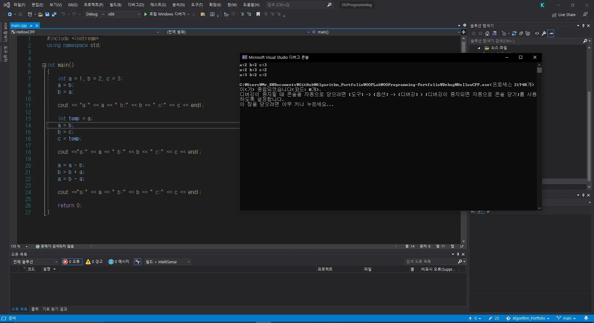

- **Swap:** This code uses a global function to swap the data between two variables.
  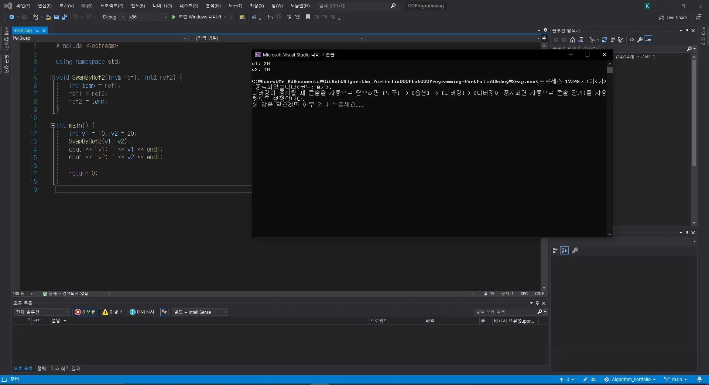

- **AddAry:** This code performs addition operations on arrays.
  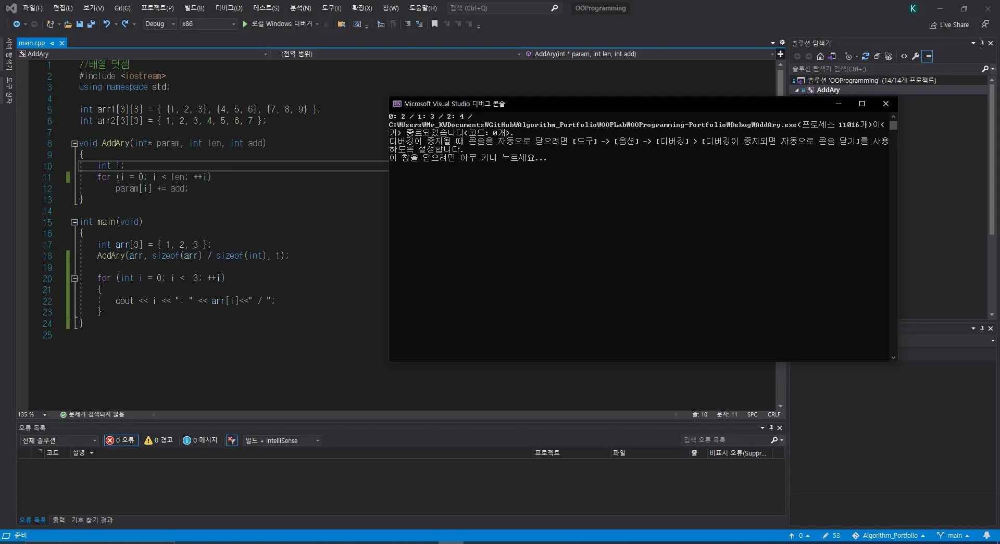

- **sum:** This code calculates the sum of all numbers from 1 to 100.
  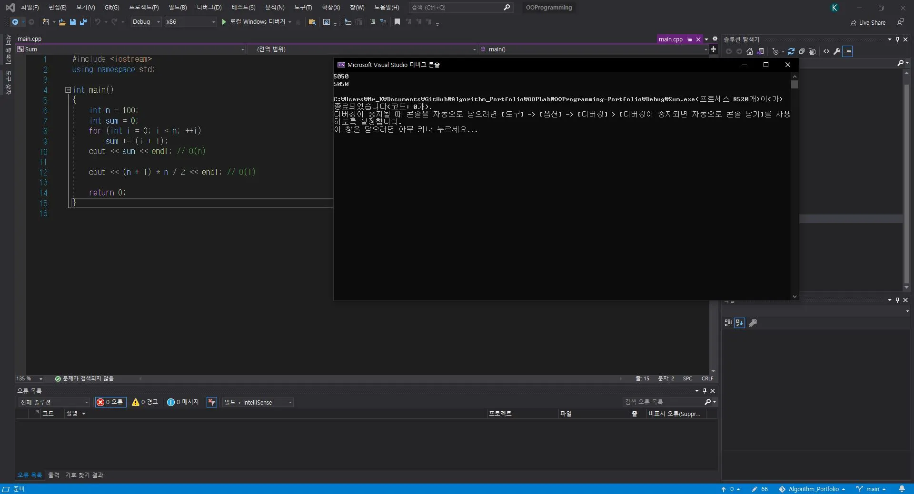

- **Arithmetic Sequence:** This code generates and sums an arithmetic sequence from 1 to n.
  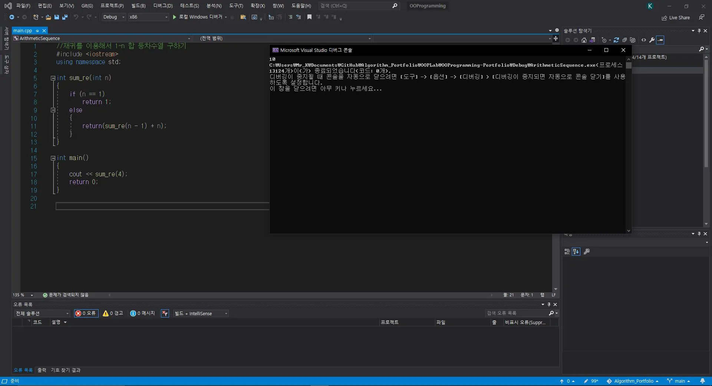

- **Factorial:** This code calculates the factorial of numbers from 1 to n.
  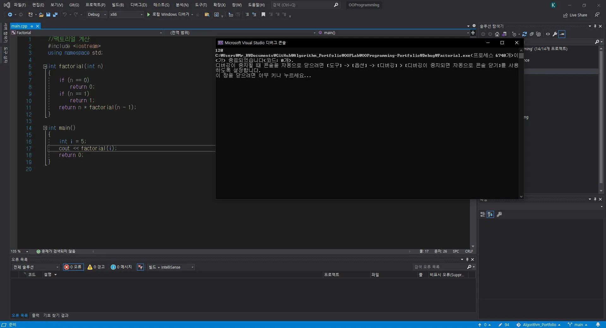

- **Fibo:** This program calculates and prints the Fibonacci sequence.
  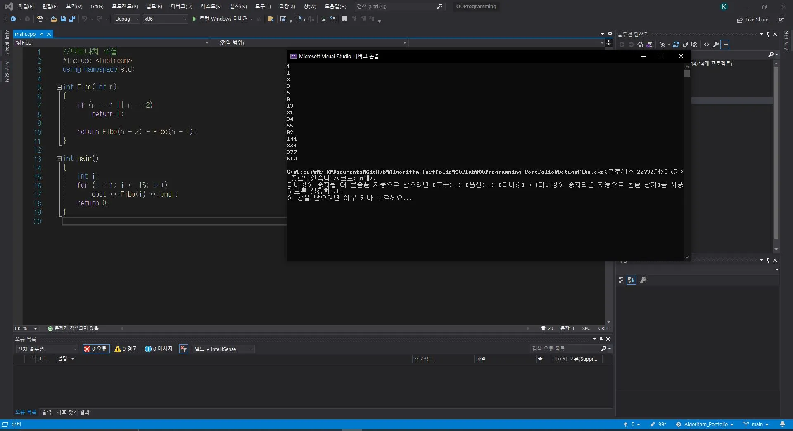

- **PascalTriangle:** This C++ program generates and prints Pascal's Triangle.
  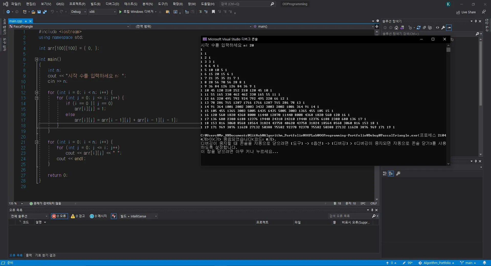

- **Convert2bin:** This code converts a decimal number to binary.
  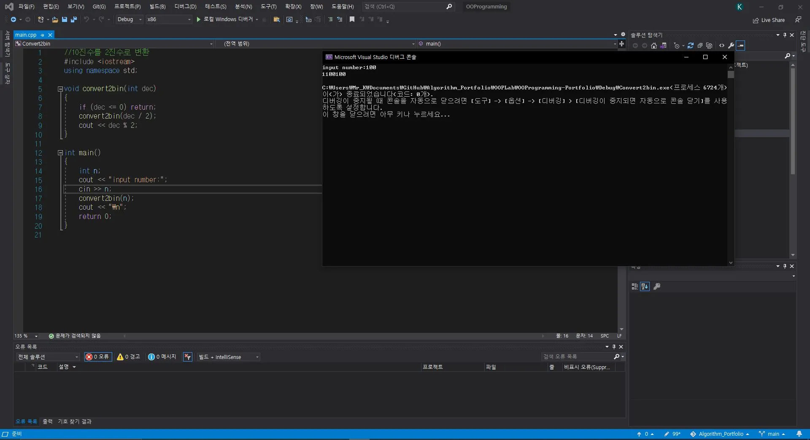

- **InlineClass:** This code practices using inline functions and regular classes.
  

- **VirtualFunction:** This code defines two class hierarchies and demonstrates the behavior of constructors, destructors, and virtual functions.
  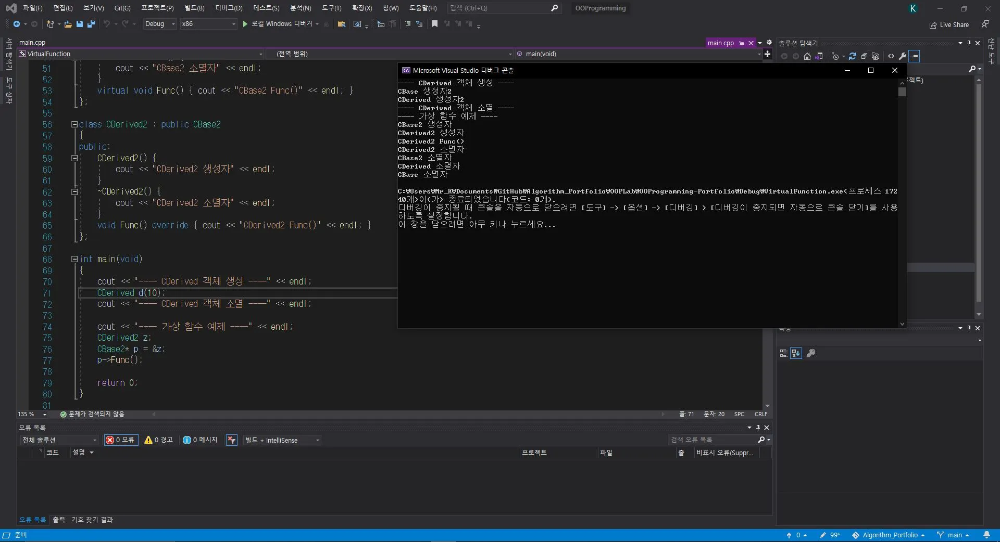

- **Override:** This code uses polymorphism and virtual functions to call the `Func()` method of Player, Boss, and Monster objects.
  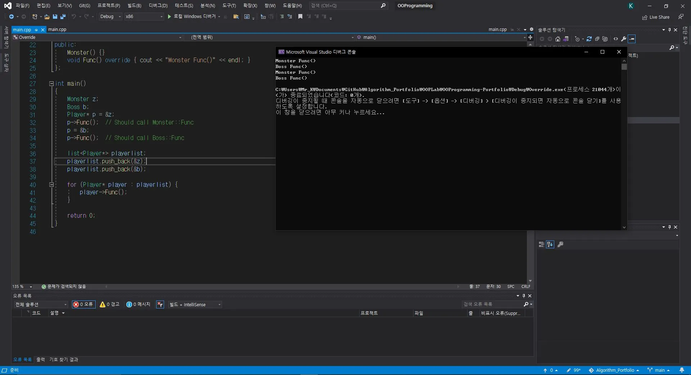

- **FunctionOverloading:** This code defines a simple Player class to manage character states and perform actions such as attack, damage handling, and jumping.
  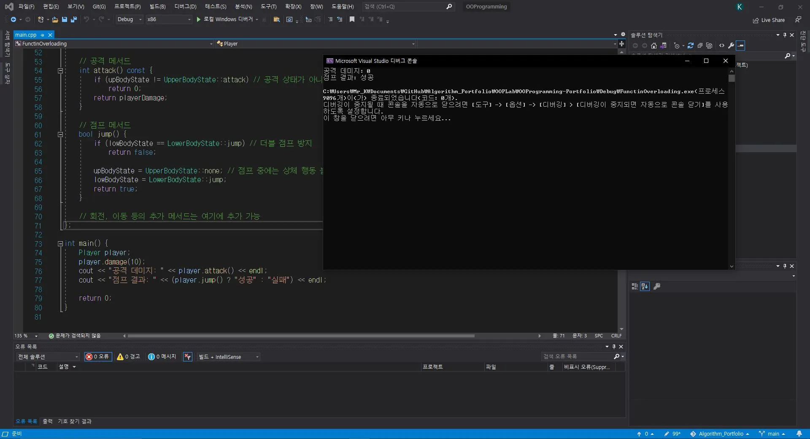

- **Inheritance:** This code defines two class hierarchies, observes their constructors and destructors, and demonstrates virtual function behavior.
  

For more details information, visit: [https://kj1241.github.io/algorithm/OOPLab](https://kj1241.github.io/algorithm/OOPLab)
  

## Simple Console Shooting Game - C++ OOPLab

### Key Points Covered:
- **shoout_2010:** 
  

### Description:
In this video, I present a simple console shooting game developed using C++. Players control characters, shoot projectiles, and try to hit their opponent. The video demonstrates the basic game play and controls.

Game Features:
- Character movement
- Projectile firing
- Shield activation
- Scoring system

For more details information, visit: [https://kj1241.github.io/algorithm/OOPLab_FinalExam](https://kj1241.github.io/algorithm/OOPLab_FinalExam)
